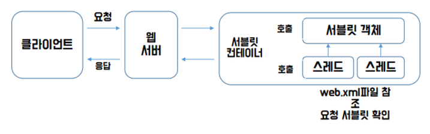
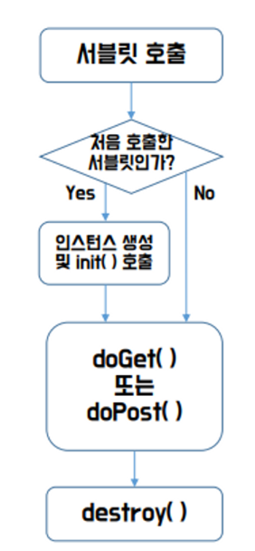
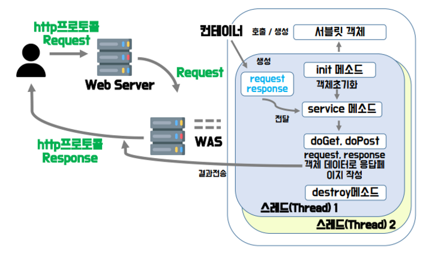

# Servlet LifeCycle
## Servlet
- Server + Applet 의 합성어로, Java 언어를 이용하여 사용자의 요청을 받아 처리하고 결과를 다시 사용자에게 전송하는 역할의 Class 파일
    + Applet = Application + let(작은) = 작은 애플리케이션
- 웹에서 동적인 페이지를 Java로 구현한 서버측 프로그램

## Servlet 동작 구조


## Servlet Container
- 웹 서버 또는 응용 프로그램 서버의 일부로, 웹 서버에서 온 요청을 받아 Servlet class를 관리하는 역할(= 생명 주기 관리)을 함
- Servlet에 대한 Containe 설정은 Deployment Descriptor(web.xml) 파일을 이용
> 쉽게 말해 Servlet을 포함하고 있는 Container가 Servlet Container 다.

## Servlet mapping
1. web.xml 이용
```xml
<servlet>
	<servlet-name>mapping명칭</servlet-name>
	<servlet-class>실제 클래스명</servlet-class>
</servlet>

<servlet-mapping>
	<servlet-name>mapping명칭</servlet-name>
	<url-pattern>사용자 접근명칭</url-pattern>
</servlet-mapping>
```

2. @annotation 이용
```java
@WebServlet(“/mapping명칭”)
public class 서블릿명칭 extends HttpServlet {
	// Servlet code
    // HttpServlet 오버라이딩
}
```

## Servlet의 LifeCycler과 구동
- Servlet LifeCycler

    

    1. 첫 요청이면 객체를 생성, init() 호출
    2. 작업이 실행 될 때마다 service() 가 요청한 HTTP Type에 따라 doGet, doPost() 를 호출
    3. 최종적으로 Servlet이 서비스 되지 않을 때 destroy() 호출
        + destroy() 보통 서버 종료 or Servlet 내용 변경 후 재컴파일 될 때 호출

<br>

- Servlet 구동

    
