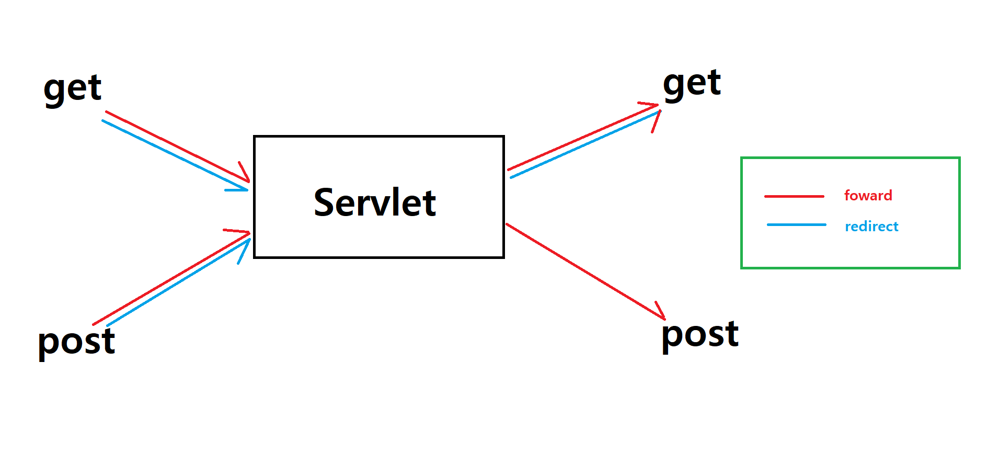

# foward와 redirect
## `foward`
- 서블릿 컨테이너 내에서 이루어지는 서버 사이드의 요청 및 응답 전송 방식
- 클라이언트의 요청을 서버 내부에서 다른 서블릿이나 JSP로 전달할 때 사용
- 클라이언트는 Forward 과정을 인지하지 못하며, URL은 변경되지 않음
- 서버 내부에서 작업을 전달하고 공유하기 위해 사용
- **foward는 특정 URL에 대해 외부에 공개되지 말아야 하는 부분을 가리는데 사용하거나 조회를 위해 사용**

## `redirect`
- 클라이언트에게 새로운 URL로 이동하도록 요청하는 방식
- 클라이언트의 웹 브라우저가 새로운 URL로 다시 요청
- 클라이언트의 URL이 변경되며, 브라우저에서는 새로운 URL을 보여줌
- 추가적인 서버 자원과 시간이 소요되지만, 클라이언트에게 완전히 새로운 페이지로 이동시킬 수 있음
- **redirect는 클라이언트의 요청에 의해 서버의 DB에 변화가 생기는 작업에 사용**

## foward와 redirect 비교

