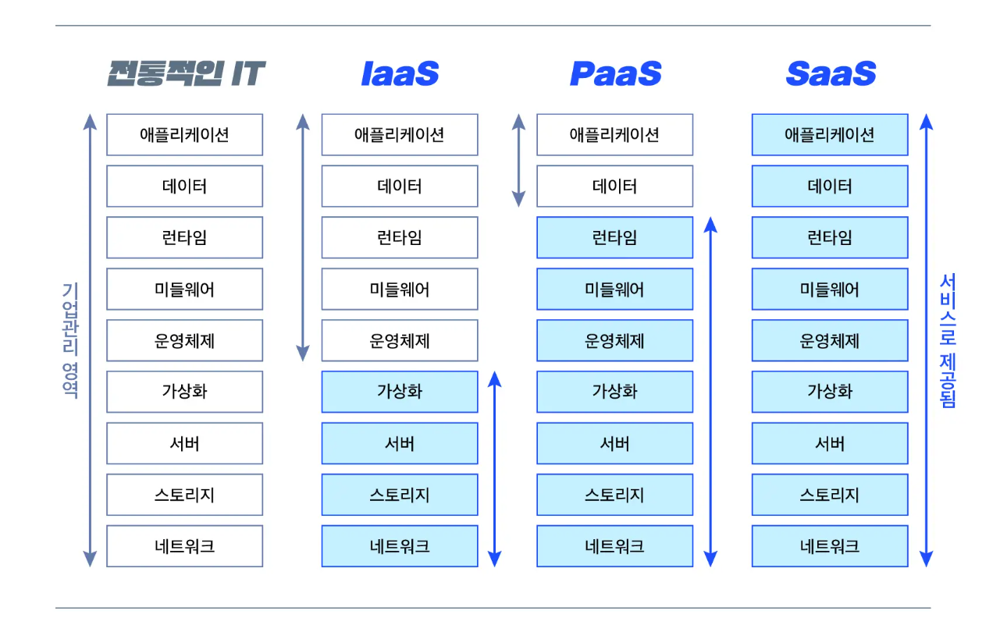

## 클라우드 서비스

### 클라우드 컴퓨팅
- 인터넷으로 가상화된 IT 리소스를 서비스로 제공하는 것을 의미
- 클라우드 컴퓨팅에서 가상화하여 서비스로 제공하는 대상 : 서버, 플랫폼, 소프트웨어

### IaaS, PaaS, SaaS 개념
- **Infrastructure as a Service(IaaS, 아이아스, 이에스)** 서비스로 제공되는 `인프라스트럭처`입니다. 개발사에 제공되는 물리적 자원을 가상화합니다.
- **Platform as a Service(PaaS, 파스)** 서비스로 제공되는 `플랫폼`입니다. 개발사에 제공되는 플랫폼을 가상화합니다.
- **Software as a Service(SaaS, 사스)** 서비스로 제공되는 `소프트웨어`입니다. 고객에게 제공되는 소프트웨어를 가상화합니다.
    > "인프라스트럭처(Infrastructure)"란 컴퓨터 시스템, 네트워크, 데이터 저장소, 서버, 런타임 환경 및 다양한 하드웨어 및 소프트웨어 구성 요소로 구성된 정보 기술 (IT) 환경의 기본적인 물리적 및 논리적 구조를 의미합니다. 이것은 컴퓨터 및 네트워크 인프라스트럭처를 포함하여 데이터 센터, 클라우드 인프라스트럭처 및 기업의 IT 인프라스트럭처를 말합니다.

### IaaS, PaaS, SaaS 차이
- **IaaS** : 클라우드 인프라스트럭처 서비스는 확장성이 높고 자동화된 컴퓨팅 리소스를 가상화하여 제공하는 것
- **PaaS** : 클라우드 플랫폼 서비스는 주로 응용 프로그램을 개발할 때 필요한 플랫폼을 제공하는 것
- **SaaS** : 클라우드 애플리케이션(소프트웨어) 서비스는 사용자에게 제공되는 소프트웨어를 가상화하여 제공하는 것, SaaS는 타사 공급 업체가 관리하는 사용자에게 응용 프로그램을 제공하기 위해 인터넷을 사용, 대부분의 SaaS 애플리케이션 웹 브라우저를 통해 직접 실행되므로 클라이언트 측에서 다운로드나 설치가 필요하지 않음

### 클라우드 서비스 모델 비교

### 클라우드 적용 시점
빠른 변화를 원한다면 `IaaS`, 신속한 개발을 원한다면 `PaaS`, 비즈니스에 집중하고 싶다면 `SaaS`

[[참고 1] https://www.whatap.io/ko/blog/9/](https://www.whatap.io/ko/blog/9/) 
[[참고 2] https://brunch.co.kr/@leedongins/60](https://www.whatap.io/ko/blog/9/)
